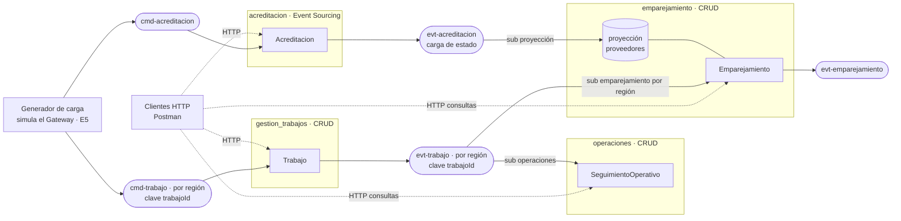

# Entrega 4 · Especificación — Fase 1 `/specify`

| Proyecto | Entrega | Estado | Fecha | Código base |
|---|---|---|---|---|
| Hogar de los Alpes | 4 — Prueba de concepto, entrega parcial | **Aprobada** (2026-09-11) | 2026-09-11 | `hogar-alpes@b7ee3df` |

**Fuentes:** enunciado `semana-6/Entrega 4 y 5.md` · rúbrica y guía `semana-6/Entrega 4 Parcial` · escenarios `entrega-3/doc/PARA-PPT-escenarios-7-8-9.md` y `entrega-3/doc/00-revision-presentacion.md` · vistas `entrega-2/diagramas/HDA-003`, `HDA-004` · `entrega-2/doc/07-puntos-sensibilidad.md` · material de semanas 4, 5 y 6.

> Este documento dice **qué** se construye y **cómo se verifica**. El **cómo** técnico (nombres físicos de tópicos, tipo de suscripción, formato y compatibilidad de esquemas, topología de Pulsar, estructura del repositorio) es de la Fase 2.

---

## 0. Decisiones en una tabla

| # | Decisión | Valor | Estado |
|---|---|---|---|
| D-1 | Escenarios a validar | MOD-1, MOD-2, MOD-3 · Escenario 6 · Escenario 8 | Fijado por el tutor |
| D-2 | Los 4 microservicios | `gestion_trabajos` · `operaciones` · `emparejamiento` · `acreditacion` | **Aprobado** (Acreditación elegido por el equipo) |
| D-3 | Plataforma de despliegue | VM en **AWS (EC2)** + Docker Compose | **Aprobado** |
| D-4 | Topología de datos | **Descentralizada**: una instancia de base de datos por servicio | Propuesta |
| D-5 | Modelo de persistencia | CRUD en `gestion_trabajos`, `operaciones`, `emparejamiento` · **Event Sourcing** en `acreditacion` | Propuesta |
| D-6 | Tipo de evento | **Integración** (delta) en `evt-trabajo` · **Carga de estado** en `evt-acreditacion` | Propuesta |
| D-7 | Esquemas | Avro + Schema Registry de Pulsar · cambio incompatible = stream nuevo `-v2` | Propuesta; se justifica en la Fase 2 |
| D-8 | Orden de eventos | Un solo stream de eventos por agregado y región, con `trabajoId` como clave | Propuesta |

---

## 1. Alcance

**Dentro** — puntos 1 a 6 y punto 9 del enunciado:

1. Comunicación entre servicios exclusivamente por comandos y eventos sobre Apache Pulsar.
2. Tipo de evento justificado por escenario; diseño y evolución de esquemas.
3. Cuatro microservicios con los comandos, consultas e infraestructura mínimos para sostener los escenarios.
4. Pulsar configurado y desplegado por el equipo.
5. Topología de administración de datos justificada e implementada.
6. CRUD o Event Sourcing por servicio, justificado.
7. Despliegue en la plataforma elegida (punto 9).

**Fuera** — es Entrega 5, aunque parezca fácil adelantarlo:

- Saga (coreografía u orquestación) y la transacción larga completa extremo a extremo.
- BFF y Gateway de Partners.
- Refinamiento del mapa de contextos y de los puntos de vista.
- Informe consolidado de resultados (punto 10). En la Entrega 4 **sí** se ejecutan las mediciones de los escenarios 6 y 8, porque la rúbrica pide que los servicios los *satisfagan*; la consolidación y el análisis son de la Entrega 5.
- El escenario 7 como escenario formal (queda como base técnica; ver §2).
- El aislamiento por partner (escenario 9): `partner_id` viaja en cada mensaje, pero sin particiones dedicadas por partner (P-1).

---

## 2. Escenarios que se sustentan

| Esc. | Atributo | Estímulo → respuesta | Medida en producción (Entrega 3) | Qué demuestra la POC | Servicios |
|---|---|---|---|---|---|
| **MOD-1** (1) | Modificabilidad | Reemplazar el adaptador de persistencia | 0 cambios en dominio | Cambiar de adaptador **por configuración**, sin tocar `dominio/` ni `aplicacion/` | GT (+ proyección de EMP detrás de un puerto) |
| **MOD-2** (2) | Modificabilidad | País nuevo sin redesplegar el servicio base | 0 cambios en el core | Entrada nueva en `reglas_regionales.json` + reinicio del sidecar | GT |
| **MOD-3** (3) | Modificabilidad | Estado nuevo en el ciclo de vida sin afectar a otros servicios | 0 servicios afectados | Estado nuevo en GT; **OPS y EMP siguen corriendo sin redespliegue** y OPS registra el estado nuevo | GT · OPS · EMP |
| **6** | Disponibilidad | El reactor de Operaciones deja de consumir ≥ 30 min | 100% de lo acumulado procesado · 0 impacto sobre el productor | §5.2 | GT · OPS · broker |
| **8** | Escalabilidad | Crecimiento sostenido ×3 trabajos/día, ×4-5 peticiones | ≥ 15.600 req/s · < 10% de degradación al duplicar réplicas · 0 interrupciones de regiones activas · consulta < 1 s p95 con > 100.000 proveedores | §5.3, a escala reducida | GT · EMP · ACR · broker |

Abreviaturas usadas en todo el documento: **GT** `gestion_trabajos` · **OPS** `operaciones` · **EMP** `emparejamiento` · **ACR** `acreditacion`.

**Sobre la escala del escenario 8.** Los 15.600 req/s son la meta de producción y no se reproducen en una VM. La POC mide la **propiedad** que promete la decisión arquitectural: que el throughput crece de forma aproximadamente lineal al agregar réplicas, que una región nueva no interrumpe a las activas y que la consulta responde en < 1 s sobre 100.000 proveedores. En la sustentación: *no probamos el número, probamos la pendiente.*

**Sobre el escenario 7.** El `202 Accepted` y el tópico de comandos que ya existen son la base sobre la que se apoya el 8. No se sustenta formalmente; su carpeta de Postman se conserva renombrada como *«Base técnica (escenario 7)»*.

---

## 3. Punto de partida: brechas en `hogar-alpes@b7ee3df`

| # | Hallazgo | Evidencia | Por qué importa | Qué exige esta especificación |
|---|---|---|---|---|
| **G-1** | `operaciones` vive en el mismo proceso que `trabajos` y **comparte su Unidad de Trabajo**: los dos hacen commit juntos | `config/uow.py:4-5` · `operaciones/aplicacion/handlers.py:31-33` | Al extraerlo se pierde la atomicidad y entra consistencia eventual (`TO-1`). No es mover carpetas: cambian la transacción, el orden y los duplicados | Suscripción Pulsar a eventos de **integración**, con base de datos y transacción propias (§4.2) |
| **G-2** | Un tópico **por tipo de evento**: `evt-trabajo-creado` y `evt-trabajo-estado` | `trabajos/aplicacion/handlers.py:19-20` | Entre servicios no hay orden entre dos tópicos. Tras una caída, `EstadoTrabajoCambiado` puede llegar antes que `TrabajoCreado`, y el handler actual lo **descarta en silencio** (`operaciones/aplicacion/handlers.py:45-46`). Eso incumple el «100%» del escenario 6 | Un solo stream de eventos por agregado (y región), con `trabajoId` como clave (D-8) |
| **G-3** | El despachador abre un cliente Pulsar **por cada mensaje** y descarta el error | `seedwork/infraestructura/despachadores.py:18-30` | (a) El costo de conexión por evento limita el throughput del escenario 8. (b) Si el broker cae después del commit, el evento se pierde sin rastro | (a) Productor reutilizado por proceso. (b) Riesgo documentado, fuera de alcance (R-3) |
| **G-4** | Todo en `public/default`, tópicos sin particionar, sin políticas | — | No hay «ventana de retención» que citar en el escenario 6 ni particiones para el 8. Sin cuota de backlog explícita, el comportamiento ante un backlog grande depende de valores por defecto | Tenant, namespaces, políticas, particiones y suscripciones declarados como código (RNF-2) |
| **G-5** | MOD-1 no tiene segundo adaptador: la fábrica devuelve siempre Postgres | `trabajos/infraestructura/fabricas.py:19-22` | El escenario está **preparado pero no demostrado**. Si el tutor pide *«muéstrenme el reemplazo»*, no hay nada que mostrar | Segundo adaptador seleccionable por configuración (CA-M1) |
| **G-6** | `GET /trabajos/<id>/seguimiento` lo sirve GT leyendo el módulo `operaciones` | `api/trabajos.py:87-93` | Después de la extracción sería una llamada GT → OPS, que está prohibida | La consulta pasa a la API de OPS; Postman reintenta con tiempo límite (R-4) |
| **G-7** | Una sola base de datos `gestion_trabajos` con las tablas de ambos módulos | `__init__.py:67-75` | — | Base de datos por servicio (D-4) |

---

## 4. Los cuatro servicios

**Común a los cuatro:** Python 3.11 · Flask + SQLAlchemy · arquitectura hexagonal (dominio → aplicación → infraestructura) · seedwork propio (la Fase 2 revisa `TO-7`) · hablan con otros servicios **solo por Pulsar** · su API HTTP es exclusivamente para clientes externos: comandos → `202`, consultas → `200`.

### 4.1 `gestion_trabajos` — existente, con ajustes

| Aspecto | Especificación |
|---|---|
| Contexto acotado | Gestión de Trabajos (núcleo) |
| Agregación | `Trabajo` ⊃ `SubTrabajo` · VO `EstadoTrabajo`, `Categoria`, `Urgencia`, `Ubicacion`, `Solicitante`. **Sin cambios de dominio** |
| Comandos | `CrearTrabajo` — HTTP `POST /trabajos` (202) y tópico `cmd-trabajo` regional · `CambiarEstadoTrabajo` — HTTP `PUT /trabajos/{id}/estado` |
| Eventos emitidos | `evt-trabajo`: `TrabajoCreado`, `EstadoTrabajoCambiado` — **integración** |
| Eventos consumidos | Ninguno |
| Consultas | `GET /trabajos/{id}` · `GET /trabajos?estado=` |
| Persistencia | **CRUD** PostgreSQL: `trabajos`, `sub_trabajos` |
| Transacción larga | La **inicia** (paso 1, §4.5) |
| Escenarios | MOD-1, MOD-2, MOD-3 · productor en los escenarios 6 y 8 |

**Cambio en el comando.** `CrearTrabajo` en `cmd-trabajo` pasa a llevar un `trabajo_id` generado por el productor, como campo opcional. Esto da la clave de partición desde el primer mensaje, hace idempotente la creación ante reintentos del productor y es una evolución **compatible** del esquema v1, que sirve para demostrar el registro de esquemas (CA-E1).

**Por qué CRUD y no Event Sourcing.** MOD-1 se sostiene sobre un repositorio clásico detrás de un puerto. Event Sourcing aquí no aporta a ninguno de los cinco escenarios, y convertiría MOD-1 en otra discusión.

### 4.2 `operaciones` — nuevo, extraído de GT

| Aspecto | Especificación |
|---|---|
| Contexto acotado | Operaciones y Calidad. En HDA-003 es un **reactor**: solo consume eventos |
| Agregación | `SeguimientoOperativo` · VO `VentanaSLA`, `Prioridad`. La política de SLA se trae del módulo actual: es decisión de Operaciones, no de Trabajos |
| Comandos | **Ninguno por tópico.** Cada evento de integración entra por una capa anticorrupción que lo traduce a un comando de aplicación **interno** (`AbrirSeguimiento`, `RegistrarCambioEstado`). No se crea un tópico de comandos sin productor |
| Eventos consumidos | `evt-trabajo` de todas las regiones · suscripción durable `operaciones` · orden por clave |
| Eventos emitidos | Ninguno en la Entrega 4. `SeguimientoAbierto` sigue siendo evento de dominio interno |
| Consultas | `GET /seguimientos/{trabajoId}` · un conteo de seguimientos por ventana de tiempo, para verificar el escenario 6 |
| Persistencia | **CRUD** PostgreSQL: `seguimientos_operativos` (`trabajo_id` único) + `eventos_procesados` (id de evento como clave), para idempotencia |
| Transacción larga | **No participa**: observa. En la Entrega 5 puede hacer de vigía de SLA |
| Escenarios | **6** · MOD-3 (consumidor que tolera un estado nuevo) |

**De señal en proceso a suscripción.** Es el cambio de diseño real de la entrega:

| | Hoy — módulo | Entrega 4 — servicio |
|---|---|---|
| Mecanismo | Señal `pydispatch` `TrabajoCreadoDominio`, **antes** del commit | Suscripción Pulsar a `evt-trabajo`, **después** del commit de GT |
| Qué recibe | El objeto evento de dominio | Mensaje Avro v1: el contrato público, no el modelo interno |
| Transacción | La misma que `trabajos` | La suya propia |
| Consistencia | Inmediata | Eventual (`TO-1`) |
| Si OPS falla | Falla el request de GT | GT no se entera; el backlog espera en el broker |
| Duplicados | Imposibles | Posibles (entrega al-menos-una-vez) → idempotencia |
| Orden | El del código | El de la clave `trabajoId` |

La quinta fila es, literalmente, el escenario 6.

### 4.3 `emparejamiento` — nuevo

| Aspecto | Especificación |
|---|---|
| Contexto acotado | Emparejamiento y Publicación |
| Agregación | `Emparejamiento` (raíz; id = `trabajoId`) · VO `CriterioBusqueda` (categoría, país, ciudad) · VO `Candidato` (proveedorId, nivel). Regla: **solo proveedores con acreditación `ACREDITADA` y vigente** |
| Modelo de lectura | `ProveedorCandidato`: proyección propia. **No es una copia** del modelo de Acreditación; es la forma que Emparejamiento necesita para buscar (capa anticorrupción) |
| Comandos | `EmparejarTrabajo` — **interno**, disparado por `TrabajoCreado`. Es coreografía, el valor por defecto de `PS-5`. Sin tópico de comandos en la Entrega 4; si la Entrega 5 orquesta, se agrega `cmd-emparejamiento` |
| Eventos consumidos | `evt-trabajo` regional (un grupo de consumidores por región) · `evt-acreditacion` (alimenta la proyección) |
| Eventos emitidos | `evt-emparejamiento`: `CandidatosIdentificados`, `SinCandidatos` — **integración**. Se publican aunque nadie los consuma todavía: los escuchará la saga de la Entrega 5 |
| Consultas | `GET /candidatos?categoria=&pais=&ciudad=` (la del escenario 8) · `GET /emparejamientos/{trabajoId}` |
| Persistencia | **CRUD** PostgreSQL: `proveedores_candidatos` (proyección; upsert por versión) + `emparejamientos` |
| Transacción larga | **Participa**: paso 2, identificar candidatos. En la Entrega 4 no asigna |
| Escenarios | **8** · refuerza MOD-1 (proyección detrás de un puerto) y MOD-3 |

### 4.4 `acreditacion` — nuevo

| Aspecto | Especificación |
|---|---|
| Contexto acotado | Acreditación: subdominio núcleo; *la confianza es el diferenciador* (Entrega 2) |
| Agregación | `Acreditacion` (raíz) · referencia a `Proveedor` **por id** (`PS-10`) · país, ciudad · `homologaciones` (VO: categoría certificada) · VO `NivelAcreditacion`, `Vigencia`, `EstadoAcreditacion` (`SOLICITADA → ACREDITADA → REVOCADA \| VENCIDA`) |
| Comandos | Por tópico `cmd-acreditacion` y por HTTP: `SolicitarAcreditacion`, `AprobarAcreditacion`, `RevocarAcreditacion` |
| Eventos emitidos | `evt-acreditacion`: `AcreditacionActualizada` — **carga de estado** (snapshot completo + versión), uno por cada cambio |
| Eventos consumidos | Ninguno |
| Consultas | `GET /acreditaciones/{id}` (reconstruida desde el log) · `GET /acreditaciones/{id}/eventos` (el historial: la razón de ser del Event Sourcing aquí) |
| Persistencia | **Event Sourcing** sobre PostgreSQL: tabla append-only `eventos_acreditacion` (agregado, versión, tipo, datos, fecha), con unicidad (agregado, versión) como control de concurrencia optimista |
| Transacción larga | No participa en la Entrega 4: es precondición, porque alimenta la proyección. En la Entrega 5 es candidato natural a un paso de *verificar vigencia antes de asignar*, que cierra `PS-10` |
| Escenarios | **8**: es el modelo de escritura del CQRS parcial |

**La carga de 100.000 proveedores entra por `cmd-acreditacion`.** La proyección se llena por el mismo camino que en producción, no con un `INSERT` directo sobre la tabla de Emparejamiento.

**Por qué Event Sourcing aquí y solo aquí.**

1. **Auditoría:** quién acreditó a quién, cuándo y con qué evidencia. Es el proceso que el negocio vende como diferenciador.
2. **El ciclo de vida importa más que el estado actual:** re-validaciones, vencimientos, revocaciones.
3. **Bajo volumen de escritura:** ~100.000 agregados con pocos eventos cada uno.
4. **El costo típico del Event Sourcing —consultar— no lo paga este servicio.** Nadie lee su base de datos: el lado de lectura es la proyección de Emparejamiento. Es la topología *«CQRS con aislamiento de servicios»* de la semana 5.

**Simplificación declarada.** La cobertura geográfica se modela dentro de la acreditación (se acredita por país y por oficio regulado). En producción, la proyección cruzaría además `evt-proveedor`, que no está en el alcance.

### 4.5 Transacción larga de referencia — no se orquesta en la Entrega 4

**Asignación de un trabajo**, el tramo inicial de la transacción larga del enunciado:

| Paso | Servicio | Acción | Entrega 4 | Compensación (Entrega 5) |
|---|---|---|---|---|
| 1 | GT | `CrearTrabajo` → `TrabajoCreado` | ✅ | Cancelar trabajo |
| 2 | EMP | Identificar candidatos acreditados → `CandidatosIdentificados` | ✅ | Liberar candidatos |
| 3 | ACR | Verificar vigencia del candidato elegido | ⬜ | — |
| 4 | GT | Asignar proveedor → `ASIGNADO` | ⬜ | Re-emparejar o cancelar |
| — | OPS | Observa todo el flujo | ✅ | — |

La Entrega 4 deja funcionando los pasos 1 y 2, con los servicios «oyéndose» por tópicos, tal como pide la guía. Los pasos 3 y 4 y las compensaciones son la saga de la Entrega 5.

---

## 5. Diseño por escenario

### 5.1 Mapa de mensajes

Los nombres son **lógicos**; los nombres físicos (tenant, namespaces, sufijos de región) son de la Fase 2.

| Stream | Tipo | Productor | Consumidores (suscripción) | Clave | Escenarios |
|---|---|---|---|---|---|
| `cmd-trabajo` · por región | Comando | Generador de carga (el Gateway en E5) | GT | `trabajoId` | 8 (base del 7) |
| `evt-trabajo` · por región | Evento de integración | GT | OPS (`operaciones`) · EMP (una por región) | `trabajoId` | 6 · 8 · MOD-3 |
| `cmd-acreditacion` | Comando | Clientes / carga inicial | ACR | `proveedorId` | 8 |
| `evt-acreditacion` | Evento de carga de estado | ACR | EMP (proyección) | `proveedorId` | 8 |
| `evt-emparejamiento` | Evento de integración | EMP | — (E5) | `trabajoId` | — |

Las líneas punteadas son HTTP **desde clientes externos**, nunca entre servicios.

### 5.2 Escenario 6 · Disponibilidad — el reactor se cae y nadie más lo nota

**Mecanismo.** Cada suscripción es un cursor independiente sobre un log durable. Si OPS deja de consumir, crece **su** backlog; el productor sigue escribiendo en el log y las demás suscripciones siguen avanzando.

**Configuración que el escenario exige.**

1. **Suscripción `operaciones` pre-aprovisionada** por la infraestructura, no creada por el primer arranque de OPS. Si OPS nunca llegó a arrancar, los eventos igual se retienen para él.
2. **La «ventana de retención» del escenario es el TTL de mensajes.** Precisión técnica para la sustentación: en Pulsar la *retention policy* aplica a los mensajes **ya confirmados**. Lo no confirmado vive en el backlog de la suscripción hasta que se confirma, vence el TTL o lo desaloja la cuota de backlog. Por eso la ventana del escenario la fijan el **TTL** y la **cuota**, no la política llamada *retention*.
3. **Cuota de backlog con una política que nunca bloquee al productor:** desalojar lo más antiguo del backlog, no retener ni rechazar al productor. Es la decisión que hace que *«el consumidor cayó»* signifique *«el consumidor se atrasó»* y no *«el productor se bloqueó»*. Con una política que retiene al productor, una caída larga del reactor degradaría a GT, que es exactamente lo que el escenario prohíbe.
4. **Riesgo aceptado (Entrega 3):** si la caída supera la ventana, se pierden eventos. Operaciones no tiene implicaciones regulatorias.
5. **Valor propuesto: TTL de 7 días.** El volumen es del orden de cientos de MB por día (36.000 trabajos/día × pocos eventos por trabajo × < 1 KB por evento), así que una ventana generosa es barata. Cubre una caída de fin de semana con margen.
6. **Orden por `trabajoId`** (resuelve G-2) + **idempotencia** con `eventos_procesados`.

**Procedimiento** — automatizado con un script, parametrizado por *N* trabajos y *T* minutos:

1. Línea base con OPS arriba: latencia p95 y tasa de error de `POST /trabajos`.
2. Detener OPS.
3. Generar *N* trabajos y cambios de estado durante *T* minutos. *T* = 30 en la corrida formal; *T* = 2-3 en la demo en vivo. La propiedad no depende de *T* mientras *T* sea menor que la ventana.
4. Durante la caída: GT responde; `pulsar-admin` muestra el backlog de `operaciones` creciendo y el de EMP en ≈ 0.
5. Arrancar OPS y medir el tiempo de drenaje.
6. Verificar conteos, duplicados y orden.

**Criterios de aceptación.**

| # | Criterio |
|---|---|
| CA-6.1 | 0 errores 5xx y 0 timeouts en GT durante la caída |
| CA-6.2 | p95 de `POST /trabajos` durante la caída ≤ 1,10 × la línea base, y < 500 ms |
| CA-6.3 | Backlog de la suscripción `operaciones` = número de eventos publicados durante la caída |
| CA-6.4 | Tras reanudar: seguimientos creados = *N* (100%) · backlog = 0 · 0 duplicados |
| CA-6.5 | Los cambios de estado emitidos durante la caída quedan aplicados en orden: 0 eventos huérfanos |
| CA-6.6 | EMP no acumuló backlog mientras OPS estaba caído: las suscripciones están aisladas entre sí |
| CA-6.7 | *(Opcional)* En un namespace de prueba con TTL corto se evidencia la expiración: documenta el riesgo aceptado |

### 5.3 Escenario 8 · Escalabilidad — crecer agregando capacidad, no rediseñando

**Particionamiento.**

| Dimensión | Dónde vive | Por qué |
|---|---|---|
| **Región** | Un stream por región: Andina (CO), Norteamérica (MX), Cono Sur (BR, AR), como en el diagrama del escenario 8. La asignación país → región es **configuración**, no código | Agregar una región es crear su stream y su grupo de consumidores; los streams existentes no se tocan. Eso es lo que hace medible *«0 interrupciones en regiones activas»* |
| **`trabajoId`** | Clave de partición dentro de cada stream regional | Orden garantizado dentro de un trabajo, paralelismo entre trabajos. El paralelismo máximo lo fijan las particiones y el tipo de suscripción (Fase 2) |
| **Partner** | `partner_id` viaja como propiedad de **cada** mensaje; **sin** particiones dedicadas por partner | Decisión del equipo (P-1): el aislamiento entre partners es la medida del escenario 9, que no se sustenta. El dato ya viaja, así que dedicar particiones después es enrutamiento, no rediseño |

**Proyección de lectura de proveedores.**

- **Qué la alimenta:** `evt-acreditacion`, eventos de carga de estado. Upsert en `proveedores_candidatos` **solo si la versión entrante es mayor que la almacenada**: idempotente y tolerante al desorden.
- **Qué tan fresca debe estar:** retraso p95 < 5 s entre la publicación en ACR y la visibilidad en la consulta, en operación normal. Justificación de negocio: un proveedor recién acreditado que aparece unos segundos tarde no le hace daño a nadie. El riesgo real es la **revocación tardía** (`PS-10`), y ese se cierra en la Entrega 5 verificando la vigencia al momento de asignar (§4.5, paso 3). Durante la carga masiva de 100.000 la proyección puede atrasarse; se reporta el retraso máximo.
- **Índices** para la consulta por (categoría, país, ciudad, estado).

**Procedimiento.**

| Paso | Qué se hace | Qué se mide |
|---|---|---|
| a | Carga de 100.000 acreditaciones por `cmd-acreditacion` | Tiempo de carga · retraso de la proyección |
| b | Carga de lectura sobre `GET /candidatos` con combinaciones reales de categoría, país y ciudad | p95 |
| c | Backlog precargado de *M* `TrabajoCreado` en un stream regional; se drena con *k* = 1, 2 y 4 réplicas de EMP | Throughput = *M* / tiempo de drenaje. Aísla el consumidor de la velocidad del productor |
| d | Con carga sostenida en Andina, se habilita Cono Sur: stream + grupo de consumidores | Throughput y errores de Andina antes, durante y después |

**Criterios de aceptación.**

| # | Criterio |
|---|---|
| CA-8.1 | La proyección tiene ≥ 100.000 proveedores y se alimentó **solo por eventos**: conteo en la proyección = conteo de acreditaciones aprobadas en ACR |
| CA-8.2 | `GET /candidatos` p95 < 1 s con ≥ 100.000 proveedores |
| CA-8.3 | Throughput con 2 réplicas ≥ 1,8 × el de 1 réplica (degradación < 10%). Con 4 réplicas se reporta el valor (R-2) |
| CA-8.4 | Habilitar una región nueva no produce errores ni reinicios en las regiones activas, y su throughput no cae más de 10% durante el cambio |
| CA-8.5 | Dentro de un mismo `trabajoId`, los eventos se procesan en orden |
| CA-8.6 | Retraso p95 de la proyección < 5 s en operación normal |

### 5.4 Modificabilidad — no romper nada y demostrar entre servicios

| # | Criterio |
|---|---|
| CA-M1 | Con el segundo adaptador seleccionado por configuración, GT pasa sus pruebas y la colección de Postman, y el cambio que agrega el adaptador **no modifica ningún archivo** de `dominio/` ni `aplicacion/` (verificable con `git diff --stat` sobre esas carpetas). El adaptador concreto se elige en la Fase 2 |
| CA-M2 | Agregar un país en `reglas_regionales.json` y reiniciar el sidecar: 0 archivos de código cambiados · la carpeta de Postman del escenario 2 queda en verde |
| CA-M3 | Agregar un estado nuevo al grafo de GT y **redesplegar solo GT**: OPS y EMP no se reinician (mismo contenedor, uptime continuo), 0 errores de deserialización, y OPS registra el estado nuevo. Funciona porque el estado viaja como texto en el contrato, no como enumeración cerrada (RS-5) |
| CA-M4 | `pytest` y la colección existente, ajustada por G-6, en verde |

Con la extracción, **MOD-3 queda más fuerte que en la Entrega 3**: *«sin afectar otros servicios»* deja de ser otro módulo del mismo proceso y pasa a ser literalmente otros procesos, que ni se reinician.

---

## 6. Tipos de evento y esquemas

### 6.1 Tipo de evento por flujo

| Flujo | Tipo | Por qué | Alternativa descartada |
|---|---|---|---|
| `evt-trabajo` · GT → OPS, EMP · escenarios 6, 8, MOD-3 | **Integración** (delta) | Comunica **hechos que disparan comportamiento**: abrir un seguimiento, emparejar. Cada consumidor tiene su propio modelo y toma solo lo que necesita. El tamaño importa porque el escenario 6 obliga a retener backlog y el 8 multiplica el volumen | **Carga de estado:** convergería aunque se perdiera un evento intermedio, pero multiplica el almacenamiento retenido y convierte el agregado completo de `Trabajo` en contrato público, lo que acopla a todos los consumidores a su forma interna. Con orden por clave más idempotencia, el delta alcanza |
| `evt-acreditacion` · ACR → EMP · escenario 8 | **Carga de estado** | La proyección debe responder **sin preguntarle nada a ACR**, porque no hay HTTP entre servicios. El snapshot hace el upsert idempotente y convergente: si un evento se pierde o llega tarde, el siguiente lo corrige, lo que mitiga `PS-10` | **Delta:** obligaría a EMP a reconstruir el estado acumulando cambios, y un delta perdido deja la proyección divergente para siempre. Es el argumento de convergencia de la semana 4 |
| `evt-emparejamiento` · EMP → (E5) | **Integración** | Resultado de un paso de la transacción larga | — |
| `cmd-*` | **Comando** | Imperativo, punto a punto, un solo consumidor lógico | — |

Los **eventos de dominio** siguen existiendo dentro de cada servicio, en proceso, y se mapean a eventos de integración en la capa de infraestructura, como hoy.

### 6.2 Requisitos de esquema

| # | Requisito |
|---|---|
| RS-1 | Todo mensaje entre servicios tiene esquema declarado y registrado; productor y consumidor lo validan al conectarse |
| RS-2 | Sobre común tipo CloudEvents (ya existe: `id`, `type`, `specversion`, `time`, `service_name`) + identificador de correlación, que mitiga `TO-4` |
| RS-3 | Los cambios compatibles (agregar un campo opcional con valor por defecto) ocurren en el mismo stream, bajo una **regla de compatibilidad explícita** en el broker, no la que venga por defecto |
| RS-4 | Un cambio incompatible crea un **stream nuevo** (`-v2`), con publicación dual durante la migración: *Event Stream Versioning* |
| RS-5 | Los valores de dominio abiertos (estados, categorías) viajan como texto. Una enumeración cerrada en el esquema rompería MOD-3 |
| RS-6 | La versión es visible en el código: paquetes `schema/v1`, `schema/v2` |

**Decisión propuesta:** Avro con el Schema Registry integrado de Pulsar, que ya está en uso (`AvroSchema(...)` en `despachadores.py:21` y `consumidores.py:28`). La justificación completa frente a Protobuf y JSON, y la regla de compatibilidad elegida, van en la Fase 2.

| # | Demostración |
|---|---|
| CA-E1 | Agregar un campo opcional (p. ej. `trabajo_id` en `CrearTrabajo`) es aceptado por el registro, y los consumidores con la versión anterior siguen funcionando |
| CA-E2 | Publicar un esquema incompatible en el mismo stream es **rechazado por el broker** |

---

## 7. Topología de administración de datos: descentralizada

| Servicio | Instancia | Modelo | Tablas |
|---|---|---|---|
| GT | `postgres-trabajos` | CRUD | `trabajos`, `sub_trabajos` |
| OPS | `postgres-operaciones` | CRUD | `seguimientos_operativos`, `eventos_procesados` |
| EMP | `postgres-emparejamiento` | CRUD (proyección + escritura) | `proveedores_candidatos`, `emparejamientos` |
| ACR | `postgres-acreditacion` | Event Sourcing | `eventos_acreditacion` |

**Por qué descentralizada, argumentado desde los escenarios.**

1. **Escenario 6.** Al reanudar, OPS drena todo el backlog acumulado como una ráfaga de escrituras. En una instancia compartida (topología híbrida), esa ráfaga compite con las escrituras de GT, que es el productor, y lo degrada. Es el vecino ruidoso que el escenario prohíbe.
2. **Escenario 8.** Su segunda decisión arquitectural es *«base de datos por servicio con escalado independiente»*. La proyección de EMP es de lectura intensiva y ACR es de escritura append-only: perfiles que no deben compartir recursos.
3. **La topología híbrida no aplica.** Según el material de la semana 5, la híbrida agrupa servicios **del mismo equipo y del mismo contexto acotado**. Aquí hay cuatro contextos acotados distintos: no existe una agrupación legítima.

**Tradeoff aceptado (`TO-3`):** cuatro bases de datos que operar, parchar y versionar. En la nube, la híbrida sería más barata.

**Límite honesto de la POC:** en una VM, las cuatro instancias comparten el hardware del host. La topología garantiza propiedad, esquema, credenciales y ciclo de vida independientes; en producción, cada instancia va a su propio servidor o servicio gestionado.

| # | Criterio |
|---|---|
| CA-T1 | Ningún servicio tiene credenciales ni conectividad de red hacia la base de datos de otro (redes Docker separadas) |

---

## 8. Requisitos no funcionales transversales

| # | Requisito | Cómo se verifica |
|---|---|---|
| RNF-1 | **Cero llamadas síncronas entre servicios** | Cada contenedor de servicio comparte red solo con el broker y con su propia base de datos · ninguna variable de entorno apunta a otro servicio · 0 clientes HTTP en el código de los servicios |
| RNF-2 | **Pulsar configurado y desplegado por el equipo** | Tenant, namespaces, políticas (TTL, cuota, compatibilidad de esquemas), tópicos particionados y suscripciones creados por un script versionado e idempotente. Topología —standalone o multinodo— en la Fase 2; propuesta preliminar: **multinodo** (≥ 2 brokers, ≥ 2 bookies), para que la durabilidad del escenario 6 y el reparto de particiones del 8 sean reales y no nominales |
| RNF-3 | **Código que corre** | `docker compose up` desde un clon limpio deja los cuatro servicios *healthy* y la prueba de humo en verde, en local y en la VM |
| RNF-4 | **Consumidores idempotentes, productores reutilizados** | Pruebas de reentrega · una conexión de productor por proceso |
| RNF-5 | **Python** | 3.11 + Flask + SQLAlchemy en los cuatro. La regla pide al menos uno; se usan los cuatro por consistencia y porque el enunciado dice que la empresa trabaja en Python |
| RNF-6 | **Repositorio público sin secretos** | Credenciales en `.env` ignorado por git, con `.env.example` · nada de la VM ni de la nube en el repositorio |
| RNF-7 | **DDD visible** | Cada servicio con agregación, objetos valor, fábrica, puerto de repositorio + adaptador, y capas |
| RNF-8 | **Cada escenario se demuestra con un comando** | Un script o objetivo por escenario que imprime PASA/FALLA por criterio. Postman cubre las aserciones funcionales; los escenarios 6 y 8 necesitan además detener contenedores y generar carga, lo que Postman no hace |

---

## 9. Criterios de aceptación por ítem de la rúbrica

| Ítem | Pt | Criterio verificable | Evidencia |
|---|---|---|---|
| 4 microservicios que satisfacen 3 escenarios | 30 | Los 4 servicios desplegados y *healthy* · CA-M1…M4, CA-6.1…6.6 y CA-8.1…8.6 cumplidos | Colección + scripts de escenario + resultados guardados en el repositorio |
| Comunicación 100% por comandos y eventos | 20 | RNF-1 · cada interacción entre servicios de §5.1 pasa por un tópico | Diagrama · inspección de redes · búsqueda en el código |
| CRUD o Event Sourcing en ≥ 4 servicios | 25 | **4 de 4** con base de datos: 3 CRUD + 1 Event Sourcing · el Event Sourcing se demuestra: el historial es consultable y el estado se reconstruye desde él | Endpoints · tablas |
| Topología de datos | 5 | §7 en el README o anexo · CA-T1 | Documento · `docker-compose` |
| Cluster de Pulsar | 5 | RNF-2 · `pulsar-admin` muestra lo creado por el script | Script + salida |
| Tipos de evento y esquemas | 5 | §6 en el anexo · CA-E1, CA-E2 | Demostración del registro |
| Actividades por miembro | 5 | Documento con cada integrante, lo que hizo y enlaces a sus commits o PR | `docs/actividades.md` |
| Despliegue | 5 | El sistema corre en la VM · instrucciones reproducibles verificadas desde cero · justificación de la plataforma | README |

La justificación arquitectónica de las secciones 4, 6 y 7 se trasladará al README y a un anexo del repositorio público `hogar-alpes` en la Fase 4: el 70% de la nota es la sustentación y todo el equipo necesita ese texto.

---

## 10. Riesgos

| # | Riesgo | Mitigación |
|---|---|---|
| **R-1** | **Contribución equitativa.** El enunciado exige que las contribuciones se reflejen en commits y PR. Si la implementación sale de una sola cuenta, el ítem queda expuesto | En la Fase 3 las tareas se asignan por integrante, y cada servicio entra por su propio PR |
| R-2 | El escalado lineal lo limita la CPU de la VM: réplicas + 4 Postgres + Pulsar en una sola máquina | 1 → 2 réplicas como criterio duro, 4 como informativo · dimensionar la VM en la Fase 2 |
| R-3 | Si el broker cae después del commit de GT, el evento se pierde (G-3b) | Fuera de alcance: es territorio del escenario 5 y del patrón *outbox*. Se documenta como riesgo conocido |
| R-4 | La consistencia eventual se ve en las pruebas: el seguimiento aparece segundos después | Las pruebas reintentan con tiempo límite, no asumen inmediatez |
| R-5 | La carga de 100.000 acreditaciones por Event Sourcing tarda minutos | Se ejecuta antes de la demo, no en vivo |
| R-6 | Revocación tardía en la proyección (`PS-10`) | Frescura medida (CA-8.6); cierre definitivo en la Entrega 5 |

---

## 11. Preguntas cerradas (2026-09-11)

| # | Pregunta | Decisión del equipo |
|---|---|---|
| P-1 | ¿Cómo entra la dimensión partner del particionamiento? | Región en el stream + `trabajoId` como clave. `partner_id` viaja en cada mensaje, **sin particiones dedicadas por partner** |
| P-2 | ¿Proveedor de la VM? | **AWS** (EC2) |
| P-3 | Integrantes | **Stiven Cardona · Juan Manuel Domínguez · Andrés Gómez** |
| P-4 | Fecha de entrega | **2026-09-13** |
