# Guía de scripts — qué hace cada uno y cómo fluye

Este documento explica, en lenguaje sencillo, qué hace cada script del
repositorio: para qué sirve, cuándo se usa, qué le pasa por dentro y qué
demuestra. Está pensado para alguien que **no escribió el código** pero
necesita entenderlo — para la sustentación, para debug, o para retomar el
proyecto después de un tiempo.

## Índice

- [Cómo está organizado](#cómo-está-organizado)
- [`herramientas/` — las piezas que generan carga y miden](#herramientas--las-piezas-que-generan-carga-y-miden)
- [`escenarios/` — los que demuestran cada escenario de calidad](#escenarios--los-que-demuestran-cada-escenario-de-calidad)
- [`infra/pulsar/` — la topología de Pulsar como código](#infrapulsar--la-topología-de-pulsar-como-código)
- [`infra/aws/` — el despliegue en la nube](#infraaws--el-despliegue-en-la-nube)

---

## Cómo está organizado

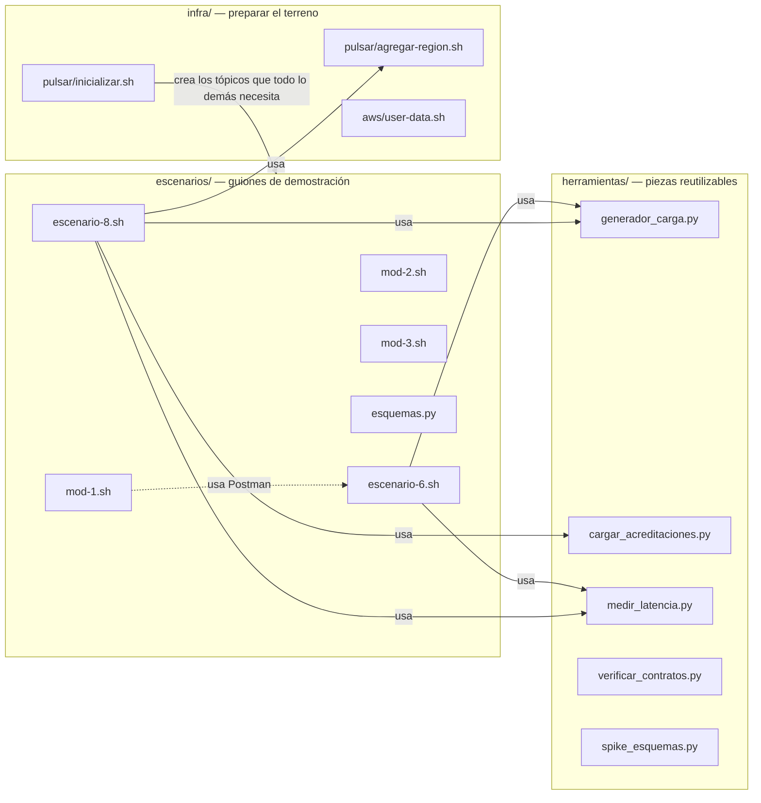

**La idea general:** `herramientas/` son piezas sueltas y reutilizables (un
generador de carga, un medidor de latencia). `escenarios/` son guiones que
**combinan** esas piezas para demostrar, con números reales, que el sistema
cumple una promesa arquitectónica concreta (disponibilidad, escalabilidad,
modificabilidad, evolución de esquemas). `infra/` prepara el terreno antes
de que cualquiera de los dos pueda correr — sin tópicos creados, no hay
dónde publicar; sin una instancia en AWS, no hay dónde desplegar.

---

## `herramientas/` — las piezas que generan carga y miden

### `generador_carga.py`

**Qué hace, en una frase:** simula clientes reales creando trabajos —
"pretende ser" el Gateway que en la Entrega 5 recibirá las peticiones de
verdad.

**Por qué existe:** los escenarios 6 y 8 necesitan tráfico real para medir
algo (sin trabajos entrando, no hay backlog que observar ni latencia que
medir). En vez de que cada escenario reinvente su propio generador, este
script se comparte entre los dos.

Tiene **tres modos**, según qué tan "real" quieras que sea el camino:

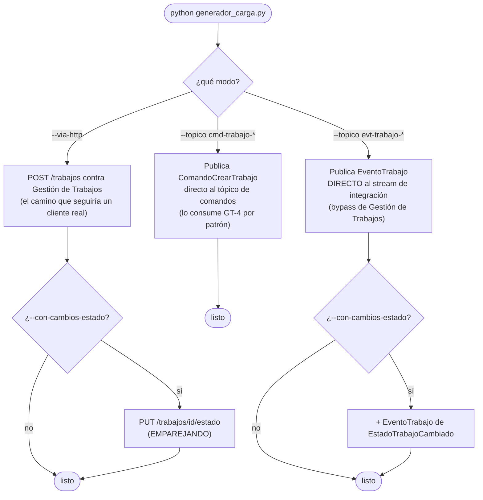

**¿Por qué tres modos y no uno solo?**

- **`--via-http`** es el más "real": pasa por Gestión de Trabajos de
  verdad, así que valida todo el camino — reglas regionales, base de datos,
  publicación del evento. Es el que usa `escenario-6.sh`.
- **`--topico evt-trabajo-*`** es un atajo: publica el evento directo en
  Pulsar, sin pasar por Gestión de Trabajos. Sirve para **precargar un
  backlog rápido** cuando lo que se quiere medir es la velocidad del
  *consumidor* (escenario 8), no la de la creación — inventar 2.000 trabajos
  reales uno por uno sería lento y no aportaría nada a esa medición.
- **`--topico cmd-trabajo-*`** es el camino que describe el plan técnico
  para cuando el consumidor de comandos de GT-4 esté completo.

**Un detalle importante que costó un bug real:** `_datos_trabajo()` no
inventa categoría/urgencia al azar de cualquier lista — lee
`infra/sidecar/reglas_regionales.json`, el mismo archivo que usa Gestión de
Trabajos, para generar solo combinaciones que ese país realmente permite. Si
no hiciera eso, la mayoría de los "trabajos" generados serían rechazados con
`400` por el sidecar regional, y el escenario mediría el generador, no el
sistema.

```bash
# Carga real contra GT, con cambios de estado
python herramientas/generador_carga.py --via-http http://localhost:8000 \
    --total 500 --tasa 20 --con-cambios-estado

# Backlog sintético para el escenario 8
python herramientas/generador_carga.py \
    --topico persistent://hogar-alpes/trabajos/evt-trabajo-andina --total 2000
```

---

### `cargar_acreditaciones.py`

**Qué hace, en una frase:** publica una acreditación tras otra —
`SolicitarAcreditacion` seguido de `AprobarAcreditacion` — para llenar la
proyección de Emparejamiento con datos realistas a gran escala (hasta
100.000 proveedores).

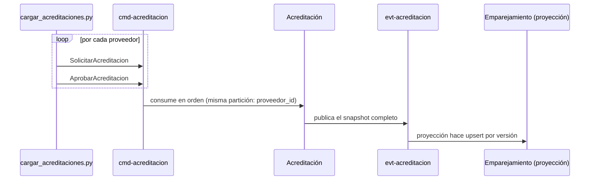

**Por qué así y no con un `INSERT` directo en la base de Emparejamiento:**
porque la especificación exige que la proyección se llene **solo por
eventos**, igual que en producción — es la prueba de CA-8.1.

**El bug que se encontró y se arregló:** al principio, publicar 200.000
mensajes muy rápido llenaba la cola interna del cliente de Pulsar más rápido
de lo que el broker podía confirmarlos, y el cliente empezaba a **descartar**
mensajes en silencio (`ProducerQueueIsFull`). La corrección
(`block_if_queue_full=True`) hace que el envío espere cuando la cola está
llena, en vez de perder el mensaje — más lento si hace falta, pero cero
pérdidas.

```bash
python herramientas/cargar_acreditaciones.py --total 100000
```

---

### `medir_latencia.py`

**Qué hace, en una frase:** dispara peticiones HTTP concurrentes contra
cualquier endpoint y calcula p50/p95/p99 (los percentiles de latencia) y la
tasa de error — sin ninguna librería externa, solo la biblioteca estándar de
Python.

**Ojo con esto:** si el método es `POST`, cada petición **crea datos reales**
— no es un simple "ping". `escenario-6.sh` lo usa dos veces con
`POST /trabajos`, y eso significa que cada corrida del escenario deja
trabajos reales en la base, además de los que generó a propósito. (Este fue
justamente el motivo de un bug real: el conteo final del escenario no
contaba esas peticiones de medición, y parecía que sobraban trabajos sin
explicación — ver la sección de `escenario-6.sh` más abajo.)

```bash
python herramientas/medir_latencia.py http://localhost:8000/health
python herramientas/medir_latencia.py http://localhost:8003/candidatos?categoria=PLOMERIA \
    --peticiones 200 --concurrencia 20 --umbral-p95-ms 1000
```

---

### `verificar_contratos.py`

**Qué hace, en una frase:** revisa los cinco contratos Avro (uno por stream)
contra el broker real, y confirma tres cosas por cada uno: que todos los
campos declaran un valor por defecto, que el "sobre" (los ocho campos tipo
CloudEvents — id, tipo, fecha, quién lo publicó...) está completo, y que un
mensaje viaja de ida y vuelta sin perder sus valores.

**Por qué existe:** dos de esos tres puntos fallaron de verdad al construir
el sistema — el sobre se perdía en silencio por cómo funciona la herencia
en `pulsar.schema`, y sin el valor por defecto el broker rechaza cualquier
evolución del contrato. Este script existe para que esos dos defectos no
puedan volver a colarse sin que algo los detecte.

```bash
python herramientas/verificar_contratos.py
```

---

### `spike_esquemas.py`

**Qué hace, en una frase:** responde, con un experimento real contra el
broker (no con una suposición), tres preguntas de las que dependía cómo se
escriben *todos* los contratos: ¿el consumidor lee con el esquema del que
escribió, o con el suyo propio? ¿en qué orden van los campos? ¿hace falta
declarar un valor por defecto explícito para que el broker acepte agregar un
campo nuevo?

Es un script de investigación, no de demostración — se corrió **una vez**,
al principio del proyecto, y el resultado quedó documentado en
`docs/decisiones.md` (sección INF-0). Se deja en el repositorio para que
cualquiera pueda reproducirlo si alguna vez hay dudas sobre el
comportamiento del cliente de Pulsar.

```bash
python herramientas/spike_esquemas.py
```

---

## `escenarios/` — los que demuestran cada escenario de calidad

Cada uno de estos scripts hace lo mismo en espíritu: **le hace algo al
sistema, mide lo que pasó, y compara contra un umbral** — imprime `PASA` o
`FALLA` por cada criterio, y guarda todo el detalle en
`docs/resultados/<escenario>-<fecha>.md`.

### `escenario-6.sh` — Disponibilidad

**La pregunta que responde:** si Operaciones se cae por media hora, ¿Gestión
de Trabajos se entera? ¿se pierde algo?

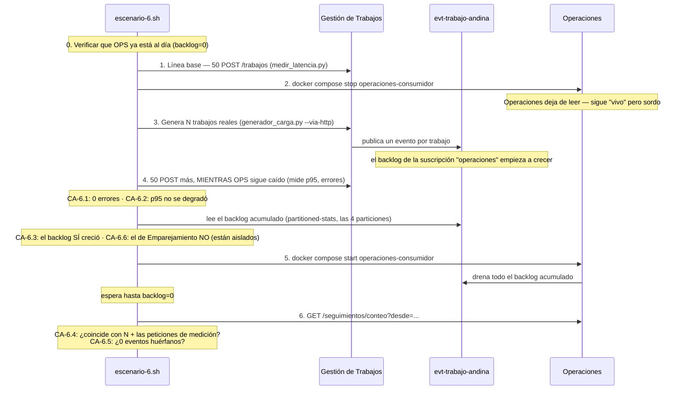

**Lo que prueba, paso a paso:**

| Paso | Qué verifica | Por qué importa |
|---|---|---|
| 0 | El backlog arranca en cero | Si quedó algo sin drenar de una corrida anterior, el conteo final saldría inflado sin que esta corrida haya hecho nada mal |
| 1 | Latencia normal, con todo funcionando | Es la vara de comparación para el paso 4 |
| 2 | Se detiene el consumidor de Operaciones | Simula la caída |
| 3 | Se genera carga real mientras está caído | Es "el trabajo que se pierde si el sistema estuviera mal diseñado" |
| 4 | Gestión de Trabajos sigue respondiendo normal | Prueba que un servicio caído no bloquea a los demás (CA-6.1, CA-6.2) |
| — | El backlog creció solo donde debía | Cada suscripción es un cursor independiente — Emparejamiento nunca se enteró (CA-6.3, CA-6.6) |
| 5 | Al reanudar, se drena todo | Nada se quedó esperando para siempre |
| 6 | El conteo final coincide exacto | 100% de lo generado quedó procesado, sin duplicados ni eventos perdidos (CA-6.4, CA-6.5) |

**Un detalle que vale la pena conocer** (fue un bug real, ya arreglado): el
paso 4 mide latencia haciendo `POST /trabajos` de verdad — esas peticiones
también crean trabajos reales. El conteo final no compara contra `N`
solamente, compara contra `N + 50` (las 50 peticiones de esa medición) —
si no, el script marcaría FALLA por una razón que no tiene nada que ver con
un defecto del sistema.

```bash
escenarios/escenario-6.sh                    # demo rápida: N=300, T=3 min
escenarios/escenario-6.sh --n 3000 --t 30     # corrida formal
```

---

### `escenario-8.sh` — Escalabilidad

**La pregunta que responde:** si agrego réplicas, ¿el sistema procesa más
rápido? Si agrego una región nueva, ¿interrumpo las que ya estaban activas?

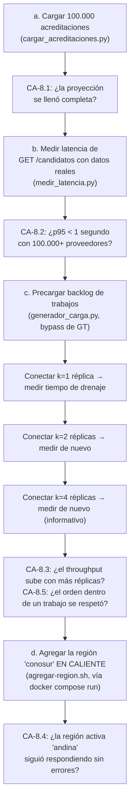

**Por qué el paso (c) no usa `--via-http`:** medir cuánto tarda el
*consumidor* en drenar un backlog no tiene sentido si al mismo tiempo se
está midiendo cuánto tarda Gestión de Trabajos en *crear* esos trabajos —
serían dos cosas mezcladas. Por eso precarga el backlog directo en Pulsar
(bypass de GT, con el consumidor **detenido**), y solo después conecta k
réplicas y mide cuánto tardan en vaciarlo — así el número que sale es
"velocidad del consumidor", no "velocidad de la conexión completa" (es el
riesgo RT-4 que el propio plan técnico nombra).

**Tres bugs reales que se encontraron y arreglaron acá** (además del de
`python`→`python3`, común a todos los scripts):

1. El nombre del servicio de Compose que se detenía/escalaba estaba mal
   (`emparejamiento-consumidor` no existe; el real es
   `emparejamiento-{región}`, una réplica por región).
2. El backlog se leía de **una sola partición** de un tópico que tiene 4 —
   con `trabajo_id` como clave, los mensajes se reparten entre las 4, así
   que "ya drenó" se declaraba en cuanto la partición 0 vaciaba, sin
   importar las otras tres.
3. El alta de la región nueva (paso d) intentaba correr `pulsar-admin`
   directo en la máquina anfitriona, pero ese comando solo existe **dentro**
   de la imagen de Pulsar — tenía que ir por
   `docker compose run pulsar-config`.

```bash
escenarios/escenario-8.sh                                          # formal: 100.000 / 2.000
escenarios/escenario-8.sh --proveedores 10000 --trabajos 500        # reducida, para depurar
```

---

### `mod-1.sh` — Modificabilidad: cambiar el adaptador de persistencia

**La pregunta que responde:** ¿se puede reemplazar cómo Gestión de Trabajos
guarda sus datos (PostgreSQL → memoria) sin tocar el dominio ni la lógica de
aplicación?

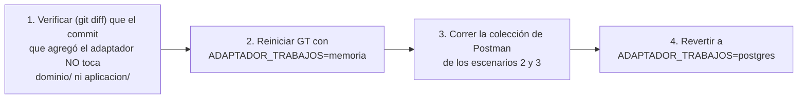

**El detalle que importa:** el adaptador en memoria guarda los datos en un
diccionario **por proceso**. Si gunicorn corriera con más de un *worker*, un
`POST` y el `GET` que lo verifica podrían caer en procesos distintos con
diccionarios distintos — por eso este script fuerza `WORKERS=1` mientras
dura la prueba.

```bash
escenarios/mod-1.sh
```

---

### `mod-2.sh` — Modificabilidad: país nuevo sin reconstruir la imagen

**La pregunta que responde:** ¿se puede agregar un país nuevo a las reglas
regionales sin tocar ni un archivo de código del servicio?

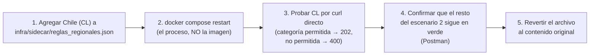

**Por qué Chile y no otro país:** la colección de Postman ya tiene un caso
que depende de que **Perú** no esté configurado (cae al contrato por
defecto). Si este script agregara Perú, rompería esa otra prueba en vez de
sumarse a ella.

```bash
escenarios/mod-2.sh
```

---

### `mod-3.sh` — Modificabilidad: estado nuevo, entre servicios

**La pregunta que responde:** ¿se puede agregar un estado nuevo al ciclo de
vida de un trabajo, redesplegando **solo** Gestión de Trabajos, sin que
Operaciones ni Emparejamiento se enteren de que existía de antemano ni
tengan que reiniciarse?

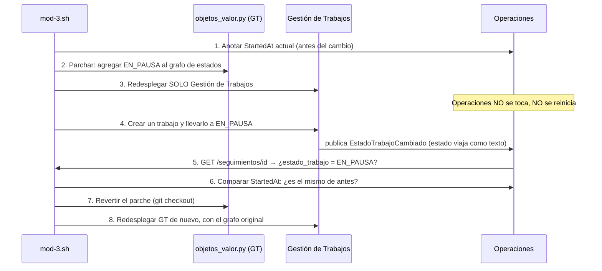

**Por qué esto funciona sin que Operaciones sepa de `EN_PAUSA` de
antemano:** el estado viaja como **texto simple** en el contrato Avro, no
como una enumeración cerrada. Si fuera una enumeración, Operaciones tendría
que conocer todos los valores posibles de antemano, y un valor nuevo lo
haría fallar al deserializar — exactamente lo que este escenario prueba que
**no** pasa.

**Una protección que vale la pena notar:** el script se **niega a correr**
si el archivo que va a parchar ya tiene cambios sin comitear — así no borra
por accidente el trabajo de otra persona con el `git checkout` final.

```bash
escenarios/mod-3.sh
```

---

### `esquemas.py` — Evolución y compatibilidad de contratos

**La pregunta que responde:** ¿el registro de esquemas realmente hace
cumplir las reglas de evolución que se declararon? (CA-E1, CA-E2)

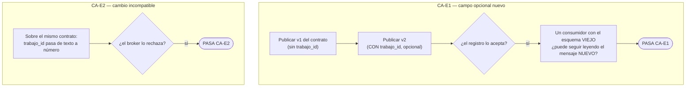

**Un detalle de diseño:** este script **importa** el contrato real
(`contratos/v1/cmd_trabajo.py`) para la versión "nueva" — no lo copia a
mano. Así, si alguien cambia el contrato real más adelante, esta
demostración evoluciona con él en vez de quedar demostrando una versión
vieja y desactualizada.

```bash
escenarios/esquemas.py
```

---

## `infra/pulsar/` — la topología de Pulsar como código

Estos no son "escenarios" — son lo que **prepara el terreno** antes de que
cualquier escenario pueda correr. Sin tópicos creados, sin suscripciones
pre-existentes, no hay dónde publicar ni qué backlog medir.

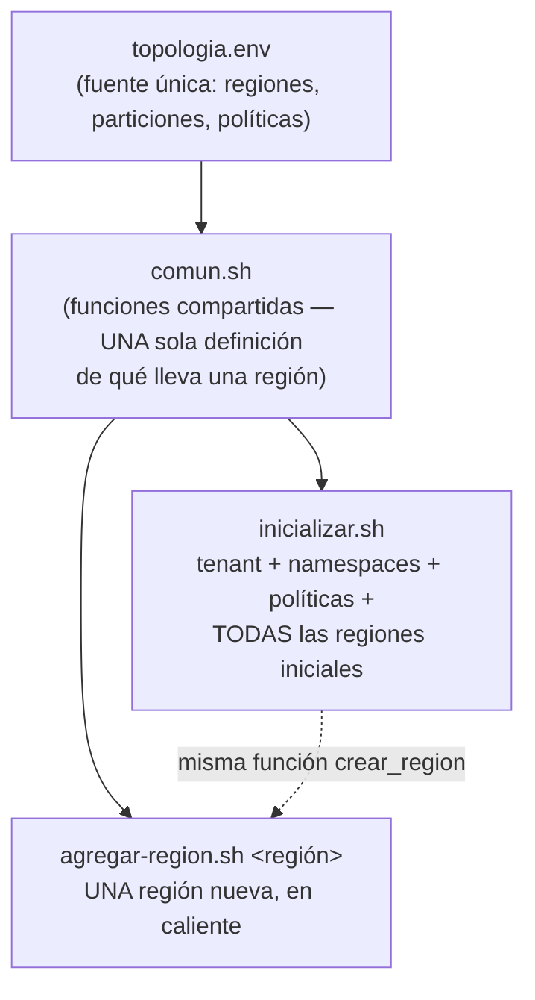

### `inicializar.sh`

Crea, de una sola vez y de forma **idempotente** (correrlo dos veces no
rompe nada): el tenant `hogar-alpes`, los tres namespaces, sus políticas
(TTL de 7 días, cuota de backlog que desaloja en vez de bloquear al
productor, compatibilidad `FULL_TRANSITIVE`), los tópicos particionados de
las regiones iniciales (`andina`, `norteamerica`), y **las suscripciones
pre-creadas** — esto último es lo que hace posible el escenario 6: si
Operaciones nunca hubiera arrancado, sus eventos igual se retendrían para
cuando por fin arrancara.

```bash
docker compose run --rm pulsar-config          # ya corre solo al hacer `docker compose up`
```

### `agregar-region.sh`

Agrega una región nueva **sin tocar ninguna de las que ya existen** — usa la
misma función `crear_region` de `comun.sh` que usó `inicializar.sh`, para
garantizar que la región nueva quede formada exactamente igual que las
originales. Es el mecanismo detrás de CA-8.4.

```bash
docker compose run --rm pulsar-config bash /infra/agregar-region.sh conosur
```

### `pulsar-manager-setup.sh`

Crea el usuario administrador de Pulsar Manager (el panel visual opcional
para la demo) por su API interna, ya que no trae ninguno por defecto.
**Nota honesta:** en la práctica esta herramienta resultó tener un bug real
de la propia imagen oficial (crea el usuario, pero el login después no lo
encuentra) — se deja documentado en `infra/pulsar/README.md` como
"mejor esfuerzo", y la alternativa confiable para ver topics/backlog en vivo
es `pulsar-admin` por línea de comandos.

```bash
docker compose --profile demo up -d pulsar-manager
infra/pulsar/pulsar-manager-setup.sh
```

---

## `infra/aws/` — el despliegue en la nube

### `user-data.sh`

Es el script que arranca **solo**, en el primer minuto de vida de una
instancia EC2 nueva (a través de lo que AWS llama "user data" — texto que
se ejecuta como root en el primer arranque). En orden:

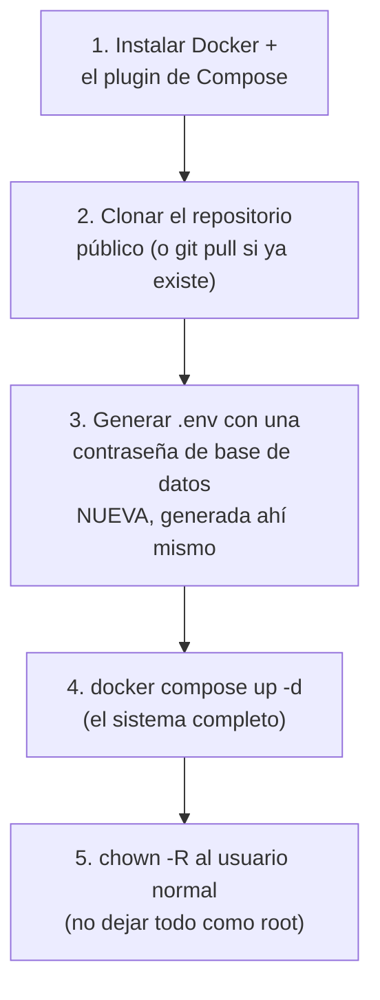

**Por qué no lleva ningún secreto:** la contraseña de PostgreSQL se genera
**en la instancia**, con `openssl rand`, nunca viene del repositorio — así
el repositorio puede ser público sin filtrar credenciales (RNF-6).

**El paso 5 es un arreglo real:** como este script corre como `root`
(así funciona el arranque de una instancia), sin ese `chown` el repositorio
quedaba de propiedad de `root`, y cualquier cosa que alguien intentara hacer
después por SSH como usuario normal —un `git pull`, o los escenarios
creando su carpeta de resultados— fallaba con "Permission denied".

No hace falta correrlo a mano si se usó como *user data* al lanzar la
instancia (vía Terraform, `infra/aws/terraform/`) — arranca solo. Si hace
falta repetirlo sobre una instancia que ya existe:

```bash
curl -fsSL https://raw.githubusercontent.com/aplicaciones-no-monoliticas/hogar-alpes/main/infra/aws/user-data.sh | sudo bash
```
