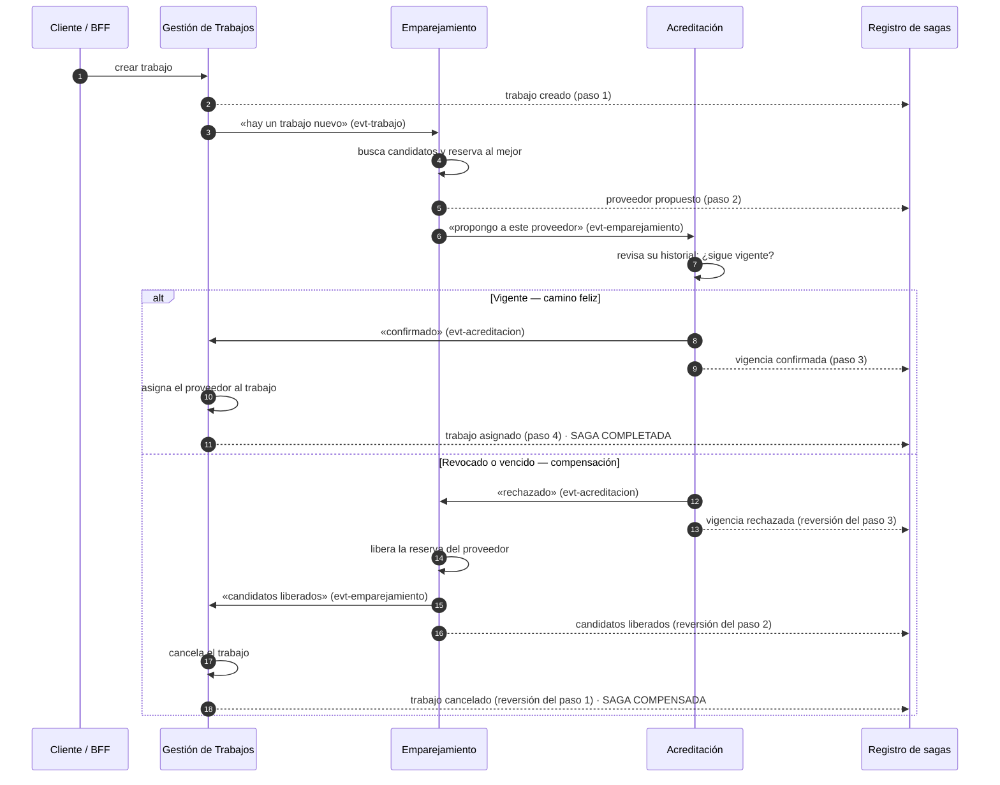

# US-01 · Saga de asignación de un trabajo, con reversiones y registro de estado

| Campo | Valor |
|---|---|
| **Entrega** | 5 |
| **Actividad del enunciado** | (a) Patrón de sagas sobre al menos 3 servicios, con compensación y saga log |
| **Servicios que participan** | `gestion_trabajos` · `emparejamiento` · `acreditacion` |
| **Servicio nuevo** | `saga_log` (solo observa; no participa en la saga) |
| **Tópicos nuevos** | **Ninguno** |
| **Estado** | Propuesta — pendiente de aprobación |

---

## La historia

> **Como** responsable de operaciones de Hogar de los Alpes,
> **quiero** que cuando un cliente solicita un trabajo el sistema le asigne
> automáticamente un proveedor certificado, y que si algo falla a mitad de
> camino todo vuelva a un estado limpio sin intervención manual,
> **para** no terminar con trabajos asignados a proveedores que ya no están
> habilitados, ni con proveedores bloqueados en trabajos que nunca se
> concretaron.
>
> **Y como** integrante del equipo técnico,
> **quiero** poder consultar en qué punto va cada transacción y por qué se
> revirtió,
> **para** poder explicar y demostrar el comportamiento del sistema sin tener
> que leer los registros de cuatro servicios distintos.

---

## Por qué esta historia existe

Hoy, cuando alguien crea un trabajo, pasan dos cosas de forma automática:
Operaciones le abre un seguimiento y Emparejamiento le busca candidatos. Y ahí
se detiene: **nadie asigna a nadie**. El trabajo se queda en estado *creado*, y
la lista de candidatos que Emparejamiento produjo queda publicada sin que nadie
la lea.

Eso deja abierto un riesgo concreto que la Entrega 4 documentó y aceptó a
propósito: Emparejamiento busca candidatos en su **propia copia** de la
información de acreditaciones, que se actualiza unos segundos después de que
Acreditación cambia algo. Si un proveedor fue revocado hace cinco segundos,
Emparejamiento todavía lo va a proponer. Mientras nadie asigne nada, eso no hace
daño. En el momento en que el sistema empiece a asignar, sí.

La solución es la misma que el negocio usaría en la vida real: **antes de
comprometer la asignación, se le pregunta a quien tiene la verdad.** Y si la
respuesta es que no, se deshace lo que ya se había hecho.

---

## Cómo funciona, en palabras

### Cuando todo sale bien

1. **Un cliente pide un trabajo.** Gestión de Trabajos lo registra y anuncia que
   existe un trabajo nuevo.
2. **Emparejamiento escucha ese anuncio**, busca en su lista de proveedores
   certificados, elige al mejor candidato, **lo reserva** para ese trabajo y
   anuncia a quién propone.
3. **Acreditación escucha esa propuesta** y revisa en su propio historial —que
   es la fuente de verdad— si ese proveedor sigue realmente habilitado y con la
   certificación vigente. Si es así, lo confirma.
4. **Gestión de Trabajos escucha la confirmación** y asigna el trabajo al
   proveedor, dejándolo en estado *asignado*.

La transacción termina **completada**.

### Cuando algo falla

La reversión viaja **hacia atrás, paso a paso**: cada servicio deshace lo suyo y
avisa al que iba antes que él.

- Si **Acreditación rechaza** al proveedor (está revocado o vencido):
  1. Acreditación anuncia el rechazo.
  2. Emparejamiento lo escucha, **libera la reserva** de ese proveedor y anuncia
     que los candidatos quedaron liberados.
  3. Gestión de Trabajos lo escucha y **cancela el trabajo**.
- Si **Emparejamiento no encuentra ningún candidato**, anuncia que no hay
  candidatos y Gestión de Trabajos cancela el trabajo directamente. Es un paso
  menos, porque no llegó a reservarse a nadie.
- Si **Gestión de Trabajos no puede asignar** (por ejemplo, porque alguien ya
  canceló el trabajo desde afuera), cancela y Emparejamiento libera la reserva
  al enterarse de la cancelación.

En todos los casos la transacción termina **compensada**, y el sistema queda sin
proveedores reservados ni trabajos a medio asignar.

### Diagrama del flujo

---

## Los pasos y sus reversiones, en una tabla

| Paso | Servicio | Qué hace | Cómo lo anuncia (tópico que **ya existe**) | Su reversión |
|---|---|---|---|---|
| 1 | Gestión de Trabajos | Registra el trabajo | `evt-trabajo-{región}` · *trabajo creado* | Cancelar el trabajo → mismo tópico, *cambio de estado* a CANCELADO |
| 2 | Emparejamiento | Elige y reserva un proveedor | `evt-emparejamiento` · *proveedor propuesto* | Liberar la reserva → mismo tópico, *candidatos liberados* |
| 3 | Acreditación | Confirma que el proveedor sigue vigente | `evt-acreditacion` · *vigencia confirmada* | Rechazar → mismo tópico, *vigencia rechazada* |
| 4 | Gestión de Trabajos | Asigna el proveedor | `evt-trabajo-{región}` · *cambio de estado* a ASIGNADO | No tiene reversión: es el último paso. Si falla, la saga se compensa desde el paso 1 |

**Ningún tópico nuevo.** Cada reversión es un **tipo de mensaje distinto sobre
el mismo canal** que el paso que deshace. Eso no es solo para no multiplicar
canales: dos mensajes que viajan por canales distintos no tienen orden
garantizado entre sí, así que una reversión podría llegarle a alguien *antes*
que el paso que revierte. Por el mismo canal, eso no puede pasar.

---

## Cómo se demuestra que funciona

### Con registros de traza

Cada servicio escribe una línea de registro, con un formato común y reconocible,
cada vez que un mensaje de la saga **le llega** y cada vez que **publica** uno.
La línea incluye siempre el **identificador de correlación**, el identificador
del trabajo, el paso, el servicio y si fue un avance o una reversión. Así, con
un solo comando que siga los registros de los tres servicios, se ve la
transacción completa recorriendo el sistema en tiempo real.

El identificador de correlación lo **crea el BFF** al recibir la petición y lo
propagan todos los servicios sin modificarlo — eso se define en
[US-02](US-02-bff.md). Es lo que permite que una sola búsqueda de texto devuelva
la cadena completa de una saga. Mientras el BFF no exista, cada servicio lo
genera si la petición o el mensaje que recibe no lo trae.

### Con banderas para simular fallos

La petición que crea el trabajo acepta una marca opcional que le pide al sistema
que falle a propósito en un punto determinado. Esa marca **viaja con el mensaje**
a lo largo de toda la cadena, igual que ya viaja hoy el identificador de
correlación.

| Marca | Qué provoca | Qué se demuestra |
|---|---|---|
| *(sin marca)* | Nada: el flujo normal | La transacción exitosa de punta a punta |
| `SIN_CANDIDATOS` | Emparejamiento actúa como si no hubiera encontrado a nadie | La compensación corta, de un solo paso |
| `VIGENCIA` | Acreditación rechaza al proveedor aunque esté vigente | La compensación completa, en cascada por los tres servicios |
| `ASIGNACION` | Gestión de Trabajos falla al asignar en el último paso | Que una falla en el último paso también se revierte |

La marca es una **propiedad del mensaje**, no un campo del contenido: se puede
leer sin descifrar el mensaje y no obliga a cambiar la forma de ningún contrato.

### Con el registro de sagas

Consultando un solo endpoint se ve el estado y la línea de tiempo completa de
cualquier transacción, sin tener que leer registros de nadie.

---

## El registro de sagas (`saga_log`)

Un microservicio nuevo, construido con la misma plantilla y las mismas
tecnologías que los otros cinco (Python, Flask, SQLAlchemy, PostgreSQL propio,
proceso de API y proceso consumidor por separado).

**Lo único que hace es escuchar y anotar.** No publica ningún mensaje, no toma
ninguna decisión y ningún servicio depende de él para funcionar. Si se cae, la
saga sigue ejecutándose exactamente igual; lo único que se pierde es la
visibilidad, y al reactivarse recupera todo lo que se acumuló mientras estuvo
abajo. **Esto es importante y hay que poder afirmarlo en la sustentación: no es
un orquestador disfrazado.**

Escucha los tres canales de eventos que ya existen y une los mensajes que
pertenecen a la misma transacción usando **dos claves, no una**:

| Clave | Para qué sirve |
|---|---|
| **Identificador del trabajo** | Es la clave de negocio de la saga: lo que un humano conoce y por lo que va a consultar (`GET /sagas/{trabajo_id}`) |
| **Identificador de correlación** | Es la clave de traza: el código único que el BFF creó para esa petición y que todos los servicios copiaron. Es lo que une la cadena en los registros y lo que cubre los pasos que no tienen un trabajo asociado |

Las dos se guardan y las dos se pueden consultar. Con esto queda cerrado el
defecto que hoy impide correlacionar: Acreditación marca sus mensajes con el
identificador del proveedor, así que sus pasos de saga no se podían unir con los
de los otros dos servicios.

Mantiene dos registros:

- **La transacción**: su identificador de correlación, el trabajo al que
  corresponde, en qué estado está, cuándo empezó y cuándo terminó.
- **Sus pasos**: uno por cada mensaje recibido, con el servicio que lo produjo,
  el paso al que corresponde, si fue avance o reversión, y el momento exacto.

Estados posibles de una transacción:

| Estado | Significa |
|---|---|
| `EN_CURSO` | Empezó y todavía no llega al final |
| `COMPLETADA` | Los cuatro pasos salieron bien: el trabajo quedó asignado |
| `COMPENSANDO` | Algo falló y las reversiones están en camino |
| `COMPENSADA` | Las reversiones terminaron: el sistema quedó limpio |
| `INCOMPLETA` | Pasó demasiado tiempo sin llegar a un estado final. No la resuelve sola: la señala para que alguien mire |

Endpoints que expone:

| Endpoint | Para qué |
|---|---|
| `GET /sagas/{trabajo_id}` | El estado y la línea de tiempo completa de una transacción |
| `GET /sagas?estado=` | Todas las transacciones en un estado dado |
| `GET /sagas/resumen` | Cuántas transacciones hay en cada estado — la vista de una sola mirada para la demostración |
| `GET /health` | Salud del servicio |

---

## Criterios de aceptación

### Funcionamiento de la saga

- [ ] **CA-1.1** — Crear un trabajo con datos válidos y un proveedor certificado
      disponible termina con el trabajo en estado **ASIGNADO** y con el
      identificador del proveedor asignado visible al consultarlo.
- [ ] **CA-1.2** — El flujo recorre los tres servicios en orden (Gestión de
      Trabajos → Emparejamiento → Acreditación → Gestión de Trabajos), y eso se
      puede comprobar en los registros de traza.
- [ ] **CA-1.3** — Con la marca `VIGENCIA`, el trabajo termina **CANCELADO**, el
      proveedor queda **sin reserva**, y los tres pasos de reversión aparecen en
      los registros en orden inverso al de ida.
- [ ] **CA-1.4** — Con la marca `SIN_CANDIDATOS`, el trabajo termina
      **CANCELADO** sin que se haya reservado ningún proveedor.
- [ ] **CA-1.5** — Con la marca `ASIGNACION`, el trabajo termina **CANCELADO** y
      el proveedor reservado queda liberado.
- [ ] **CA-1.6** — Un proveedor que quedó liberado por una compensación
      **vuelve a aparecer** como candidato para un trabajo nuevo.

### Sobre los tópicos y los contratos

- [ ] **CA-1.7** — Al terminar la historia, el sistema sigue teniendo **los
      mismos cinco tópicos** que tenía antes. Se verifica listando los tópicos
      del broker.
- [ ] **CA-1.8** — Cada reversión viaja por el **mismo tópico** que el paso que
      deshace, distinguida por su tipo de mensaje.
- [ ] **CA-1.9** — Los cambios en los contratos son **compatibles**: el broker
      los acepta sin rechazo, y las tres suscripciones que ya existían
      (Operaciones, la proyección de Emparejamiento y el consumidor regional)
      **siguen funcionando sin redesplegarse**.
- [ ] **CA-1.10** — Los consumidores que ya existían **ignoran limpiamente** los
      tipos de mensaje nuevos: la proyección de proveedores de Emparejamiento no
      se corrompe al recibir las respuestas de la saga que viajan por su mismo
      canal.

### Sobre el identificador de correlación *(corrige un defecto actual)*

- [ ] **CA-1.11** — **Todos los mensajes de una misma transacción llevan el mismo
      identificador de correlación**, el que creó el BFF, propagado sin cambios
      por los tres servicios. Hoy Gestión de Trabajos y Emparejamiento usan el
      identificador del trabajo y Acreditación el del proveedor, lo que impediría
      unir los pasos. La definición completa está en [US-02](US-02-bff.md); aquí
      se verifica sobre la saga.
- [ ] **CA-1.11b** — **La clave de partición no cambia.** Los eventos de trabajo
      se siguen particionando por el identificador del trabajo, y el orden dentro
      de un mismo trabajo se sigue cumpliendo. El identificador de correlación
      viaja en el sobre y en las propiedades del mensaje, que Pulsar no usa para
      enrutar — son dos argumentos distintos del despachador.

### Registro de sagas

- [ ] **CA-1.12** — Para cualquier transacción, `GET /sagas/{trabajo_id}`
      devuelve su estado y sus pasos en orden cronológico, con el servicio, el
      identificador de correlación y el momento de cada uno.
- [ ] **CA-1.13** — Una transacción exitosa queda en `COMPLETADA` con sus cuatro
      pasos; una compensada queda en `COMPENSADA` con sus pasos de ida y de
      vuelta.
- [ ] **CA-1.14** — El registro de sagas es **idempotente**: si el broker le
      entrega el mismo mensaje dos veces, el paso no se duplica.
- [ ] **CA-1.15** — Detener el registro de sagas **no afecta** a la saga: las
      transacciones se siguen completando y compensando con normalidad, y al
      reactivarlo recupera y registra todo lo que ocurrió mientras estuvo abajo.
- [ ] **CA-1.16** — El registro de sagas **no publica ningún mensaje**. Se
      verifica revisando que no tiene ningún productor abierto.

### Que no se rompa nada de lo que ya funcionaba

- [ ] **CA-1.17** — Las pruebas automáticas de los cuatro servicios existentes
      siguen pasando, y el servicio nuevo trae las suyas.
- [ ] **CA-1.18** — La colección de Postman actual sigue pasando completa.
- [ ] **CA-1.19** — Los escenarios de calidad de la Entrega 4 (disponibilidad,
      escalabilidad y los tres de modificabilidad) siguen dando el mismo
      resultado que antes de esta historia.
- [ ] **CA-1.20** — Ningún servicio le hace una llamada HTTP a otro: todo lo que
      cruza entre servicios sigue siendo mensajería.

### Demostración

- [ ] **CA-1.21** — Existe un guion ejecutable (`escenarios/saga.sh`) que corre
      los cuatro casos —exitoso y las tres formas de fallo— uno tras otro,
      imprime PASA o FALLA por cada criterio y guarda el resultado en
      `docs/resultados/`, igual que hacen los guiones de la Entrega 4.
- [ ] **CA-1.22** — La demostración completa se puede hacer con un solo comando
      y termina en menos de cinco minutos.

---

## Lo que **no** entra en esta historia

- Operaciones **no participa** en la saga: sigue siendo un observador que abre y
  actualiza seguimientos. No se le agrega ningún rol nuevo.
- **No hay reintentos automáticos**: si un paso falla, se compensa. No se
  reintenta antes de compensar.
- **No hay tiempos límite que disparen compensación automática.** Una
  transacción que se queda a medias se marca como `INCOMPLETA` para que alguien
  la mire, pero el sistema no la revierte solo.
- **No se implementa la saga D** (revocar una acreditación y desasignar los
  trabajos que ya tenía ese proveedor). Queda anotada como la extensión natural.
- La marca de simulación de fallos es una **herramienta de demostración**. No se
  documenta como funcionalidad del producto ni se protege con permisos.

---

## Riesgos y cosas que hay que tener en cuenta

| # | Riesgo | Cómo se maneja |
|---|---|---|
| R5-1 | **Gestión de Trabajos va a recibir todo el tráfico de acreditaciones.** Al suscribirse al canal de acreditación para oír las respuestas de la saga, también le van a llegar los cientos de miles de mensajes de la carga masiva del escenario de escalabilidad | Se acepta como costo de no crear un tópico nuevo. Se mitiga descartando por el tipo de mensaje, que se lee sin descifrar el contenido — es un descarte barato. Se mide el impacto y se reporta |
| R5-2 | **Reservar un proveedor introduce competencia.** Si dos trabajos llegan casi al tiempo y solo hay un proveedor, los dos podrían reservarlo | La reserva se hace con una restricción de unicidad en la base de datos de Emparejamiento: el segundo intento falla limpio y ese trabajo sigue al siguiente candidato o se compensa |
| R5-3 | **El sistema queda eventualmente consistente de punta a punta.** Entre crear el trabajo y verlo asignado pasan segundos | Ya es así hoy y las pruebas ya reintentan con tiempo límite. El registro de sagas hace visible ese intervalo en lugar de esconderlo |
| R5-4 | **Un servicio nuevo es un servicio más que operar**, y hay que desplegarlo también en Kubernetes (US-03) | Se construye copiando la plantilla existente, que ya trae resueltos los defectos conocidos. US-03 lo incluye en su alcance desde el principio |
| R5-5 | **Si un mensaje de reversión se pierde, la transacción queda a medias** | El broker entrega al menos una vez y los consumidores solo confirman después de aplicar. El estado `INCOMPLETA` del registro hace visible cualquier caso que aun así quede colgado |

---

## Definición de terminado

- [ ] Los veintitrés criterios de aceptación se cumplen y están verificados.
- [ ] El servicio `saga_log` corre en Docker Compose junto con los demás, con su
      propia base de datos y su propia red.
- [ ] La decisión de diseño y todo lo que se aprendió al implementarla quedan
      anotados en `docs/decisiones.md`, con el mismo formato que usa el resto
      del documento.
- [ ] `docs/actividades.md` registra quién hizo qué, con enlaces a sus
      *commits* y a su *pull request*.
- [ ] El diagrama de la saga y sus compensaciones queda en la documentación,
      listo para la sustentación.
